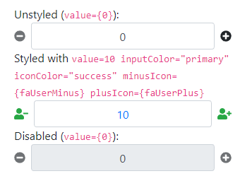

bootstrap-react-numeric-up-down
===============================



Installation
------------

```bash
npm install bootstrap-react-numeric-up-down @fortawesome/fontawesome-svg-core @fortawesome/free-solid-svg-icons @fortawesome/react-fontawesome
```

(Because I couldn't figure out how to get optional dependencies to play nice with
[rollup](https://github.com/rollup/rollup) and [next.js](https://github.com/zeit/next.js/) client-side, unfortunately
the @fortawesome packages are requirements (peer dependencies).  I'd be more than happy to incorporate a PR if someone
wants to figure it out for me.)

Usage
-----

```jsx
import NumericUpDown from 'bootstrap-react-numeric-up-down';

export default function MyComponent({value, min, max, step, ...otherProps}) {
    return (
        <NumericUpDown value={value} min={min} max={max} step={step} {...otherProps} />
    );
};
```

Properties
----------

| name                          | type                                     | default              | description                                                                                                                                   |
|-------------------------------|------------------------------------------|----------------------|-----------------------------------------------------------------------------------------------------------------------------------------------|
| allowManualInputWithNaNBounds | boolean?                                 | `false`              | By default, if the `min` is greater than the `max`, the  `<input>` is disabled.  If set, it will not be disabled. (Your mileage may vary.)    |
| iconColor                     | (string\|{minus: string, plus: string})? | `undefined`          | The bootstrap theme for coloring the button icons.                                                                                            |
| inputAlign                    | `'left'` \| `'center'` \| `'right'`      | `'center'`           | The text-alignment of the `<input>`.                                                                                                          |
| inputColor                    | string?                                  | `undefined`          | The bootstrap theme for coloring the `<input>`.                                                                                               |
| disabled                      | bool?                                    | `false`              | The `disabled` property assigned to the `<input>`.  If set, also disables the plus and minus buttons.                                         |
| max                           | (number\|string)?                        | `Infinity`           | The `max` value applied to the `<input>`.                                                                                                     |
| min                           | (number\|string)?                        | `-Infinity`          | The `min` value applied to the `<input>`.                                                                                                     |
| minusIcon                     | (string\|element\|object)?               | [`faMinusCircle`][1] | The text or icon to use for the minus button.                                                                                                 |
| onChange                      | function?                                | `undefined`          | The callback called when the value of the `<input>` changes.                                                                                  |
| plusIcon                      | (string\|element\|object)?               | [`faPlusCircle`][2]  | The text or icon to use for the plus button.                                                                                                  |
| step                          | (number\|string)?                        | `1`                  | The `step` value applied to the `<input>`.                                                                                                    |
| value                         | (number\|string)?                        | `undefined`          | The `value` property applied the `<input>`.                                                                                                   |

For the `plusIcon` and `minusIcon` properties, if an object is specified, it must match the `IconDefinition` shape
defined by @fortawesome:

```typescript
interface IconDefinition extends IconLookup {
  icon: [
    number, // width
    number, // height
    string[], // ligatures
    string, // unicode
    string // svgPathData
  ];
}

interface IconLookup {
  prefix: IconPrefix;
  iconName: IconName;
}
```

Sorry I don't have time to add better explanations for the functionality.

[1]: https://fontawesome.com/icons/minus-circle?style=solid
[2]: https://fontawesome.com/icons/plus-circle?style=solid